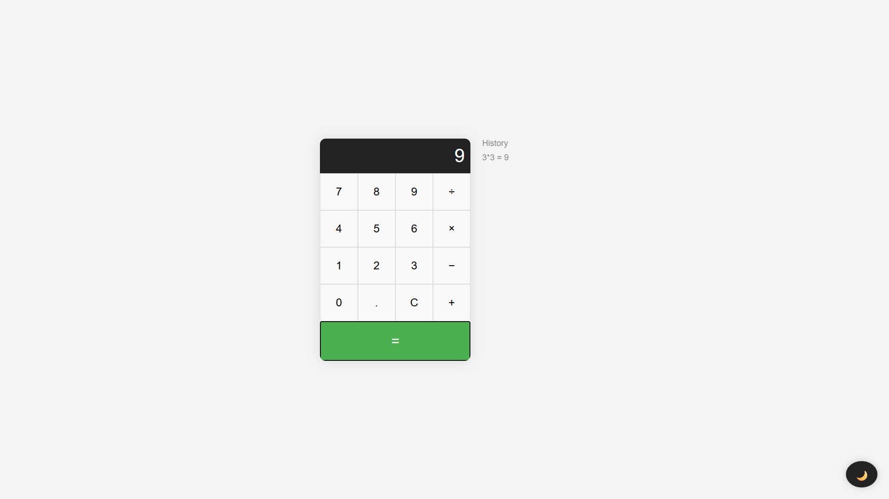
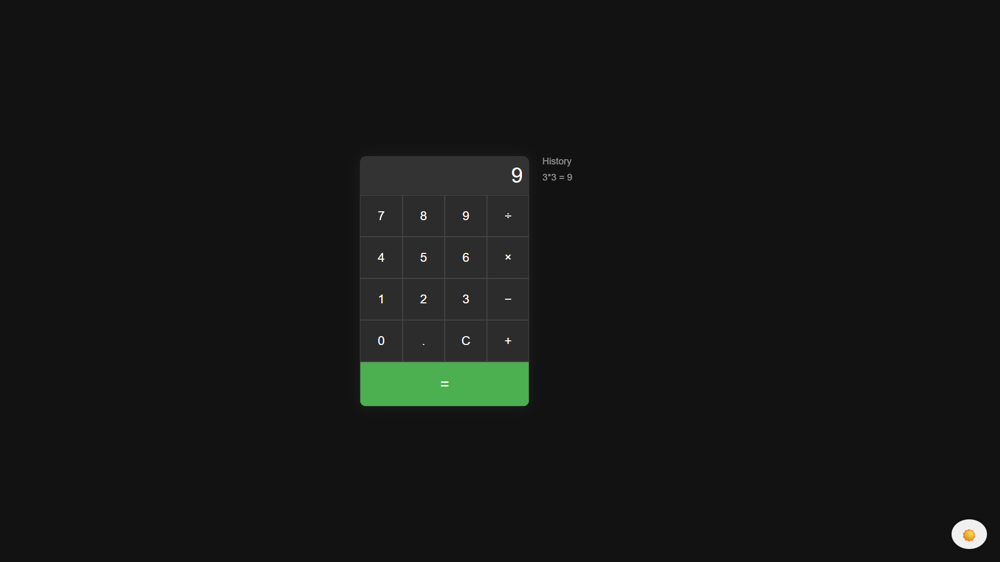
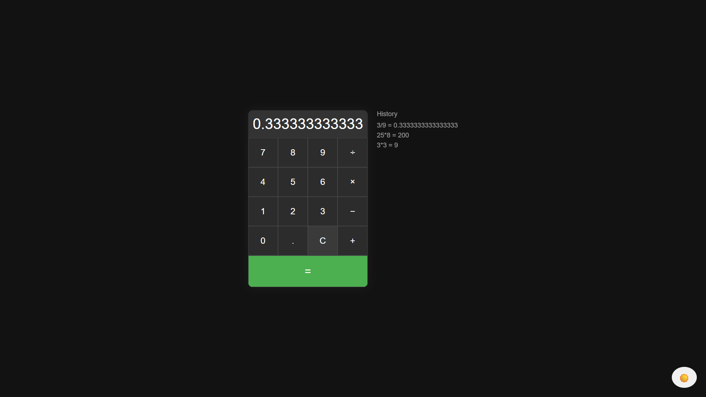

# 🧮 02 - Simple Web Projects: Calculator (HTML, CSS, JavaScript)


This is the second project in the **Simple Web Projects** series — a responsive, minimal **Calculator App** built using **HTML, CSS Grid, and vanilla JavaScript**.

---

## ✨ Features

- Basic arithmetic operations (+, −, ×, ÷)
- Live input display
- Calculation **history** (shows last 5 results)
- Toggle between **Dark/Light** mode
- Responsive layout (mobile-friendly)

---

## 📸 Screenshots

### Light Mode


### Dark Mode


### History



---

## 🚀 Getting Started

1. **Clone this repository**
   ```bash
   git clone https://github.com/vishal-git-dot/02-simple-web-projects-html-css-js.git
   ```

2. **Navigate to the folder**
   ```bash
   cd 02-calculator-html-css-js
   ```

3. **Open `index.html`** in your browser

---

## 🧠 JavaScript Concepts Used

| Concept                   | Description                                           |
|---------------------------|-------------------------------------------------------|
| `querySelectorAll()`      | Select multiple elements                             |
| `addEventListener()`      | Handle click and toggle actions                      |
| `eval()`                  | Evaluate math expressions (for demo purposes)        |
| `classList.toggle()`      | Switch between dark/light mode                       |
| `createElement()`         | Dynamically generate history items                   |
| `innerHTML` / `textContent` | Update UI content                                 |

---

## 📚 Upcoming Projects in This Series

| #   | Project Name              | Skills                                   | Features                                               |
|-----|---------------------------|------------------------------------------|--------------------------------------------------------|
| ✅ 01 | To-Do List App          | DOM manipulation, event handling, localStorage | Add, edit, delete tasks; mark as completed         |
| ✅ 02 | Calculator              | JavaScript logic, CSS grid               | Basic arithmetic operations, responsive layout         |
| 🔜 03 | Weather App             | Fetch API, JSON, async/await             | Search city, display temperature and weather           |
| 🔜 04 | Digital Clock           | Date object, setInterval                 | Live time update, dark/light mode                     |
| 🔜 05 | Quiz App                | Event listeners, arrays, conditionals    | MCQs, score tracker, optional timer                    |
| 🔜 06 | Image Slider/Carousel   | DOM manipulation, CSS transitions        | Auto-slide, next/prev, indicators                      |
| 🔜 07 | Portfolio Website       | Responsive design, layout                | About, Projects, Contact sections                      |
| 🔜 08 | Typing Speed Test       | Timers, string comparison, DOM updates   | Random text, live WPM, accuracy                        |
| 🔜 09 | Notes App               | localStorage, event handling             | Add/delete notes, save data across sessions            |
| 🔜 10 | Rock, Paper, Scissors   | Random logic, conditionals               | Play vs. computer, show result, track score            |

---

## 🛠️ Built With

- [HTML5](https://developer.mozilla.org/en-US/docs/Web/Guide/HTML/HTML5) — markup structure  
- [CSS3](https://developer.mozilla.org/en-US/docs/Web/CSS) — responsive grid layout, dark mode  
- [JavaScript](https://developer.mozilla.org/en-US/docs/Web/JavaScript) — logic, DOM manipulation  

---

## 🤝 Contributing

Contributions are welcome! Fork the repo, make changes, and open a pull request.

If you found this project helpful, consider giving it a ⭐ on GitHub!

---

Made with ❤️ as part of a self-learning journey.
